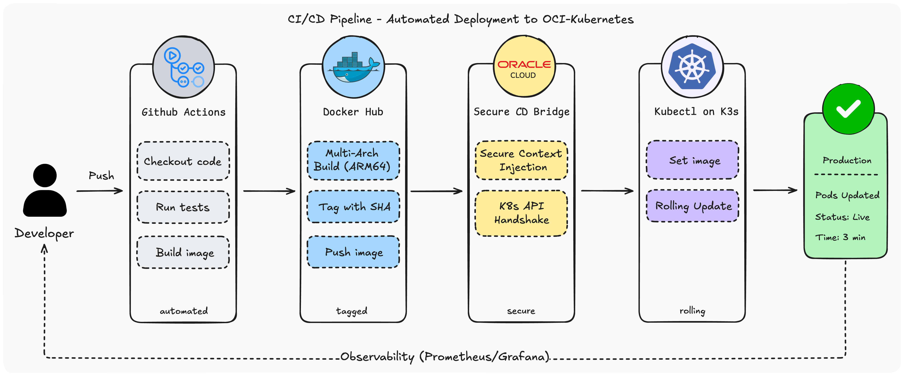

# CI/CD Pipeline

AtlasTickets uses separate GitHub Actions workflows for each service, triggered only when the corresponding service directory changes. This avoids unnecessary builds when unrelated code is modified.

## Pipeline Architecture

## Pipeline Steps

**Trigger:** Push to `main` or `cicd` branch, with path filter on `command-service/**` or `query-service/**`.

1. **Checkout code**
2. **Set up QEMU** (ARM64 emulation on GitHub's x86 runners)
3. **Set up Docker Buildx** (multi-architecture build support)
4. **Login to Docker Hub**
5. **Get Git Commit SHA** (used as image tag for traceability)
6. **Build and push Docker image** (`linux/arm64`, tagged `:latest` and `:<sha>`)
7. **Deploy via SSH** to Oracle Cloud master node:
   - Sets the image to the new SHA tag via `kubectl set image` (rolling update)
   - Waits for successful rollout via `kubectl rollout status`

## GitHub Actions Workflows

- `.github/workflows/cicd-command-service.yml`
- `.github/workflows/cicd-query-service.yml`

### Required GitHub Secrets

To make the pipeline work in your own fork, you must set these secrets:

| Secret | Description |
|---|---|
| `DOCKERHUB_USERNAME` | Docker Hub username |
| `DOCKERHUB_TOKEN` | Docker Hub access token |
| `OCI_MASTER_IP` | Public IP of K3s master node |
| `OCI_USERNAME` | SSH username on master node |
| `OCI_SSH_KEY` | Private SSH key for master node access |
