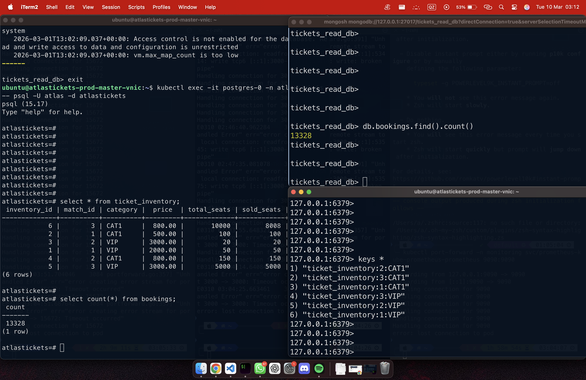

# Load Testing & Performance Results

All load tests use [k6](https://k6.io/). The test scripts target the cloud endpoint but can be modified to point at `http://api.localhost` for local testing.

## Performance Results

The following results are from the peak load test (48,077 concurrent requests against a seeded inventory of 13,328 tickets):

| Metric | Value |
|---|---|
| Total Requests | 48,077 |
| Tickets Sold | 13,328 (exact capacity) |
| Requests Rejected (Redis layer) | 34,749 |
| Oversold Tickets | 0 |
| Race Conditions | 0 |
| Error Rate | 0.00% |
| Average Rejection Latency | < 1ms (Redis Lua) |
| Peak Throughput | 31 requests/second |
| PostgreSQL vs MongoDB Consistency | Perfect (counts match) |

### What the Numbers Prove

- **13,328 sold / 13,328 capacity = 100.00% sell-through.** Not 13,327. Not 13,329. Atomicity was maintained under 48,077 competing requests.
- **34,749 rejections at < 1ms** means the Redis layer absorbed ~72% of all load before it touched a database. The database only handled confirmed sales.
- **0.00% error rate** means no request received an incorrect response — every acceptance was a valid booking and every rejection was a deliberate sold-out signal.

## Test Scenarios

| Script | VUs | Duration | Purpose |
|---|---|---|---|
| `01-warmup.js` | 100 | 30s | Verify baseline connectivity |
| `02-moderate.js` | 1,200 | ~3 min | Validate worker pool under moderate load |
| `03-afcon-peak.js` | 50,000 | ~9 min | Peak stress test simulating a major event sale |
| `04-moderatev2.js` | Staged | ~4 min | Ramp-up + sustain + ramp-down profile |

## Running Tests

**Prerequisites:**

```bash
# Install k6
brew install k6

# (Optional) Reset database state before each test run
./scripts/reset-database.sh
```

**Warmup test:**

```bash
k6 run load-tests/01-warmup.js
```

**Peak stress test (results saved to JSON):**

```bash
k6 run load-tests/03-afcon-peak.js --out json=results/peak.json
```

## Post-Test Verification

After each test, verify that no overselling occurred and that all three databases are consistent:

```bash
# Check PostgreSQL: sold seats vs total seats
kubectl exec -it postgres-0 -n atlastickets -- psql -U atlas -d atlastickets -c \
  "SELECT match_id, category, total_seats, sold_seats,
          CASE WHEN sold_seats > total_seats THEN 'OVERSOLD' ELSE 'OK' END AS status
   FROM ticket_inventory;"

# Check MongoDB: booking count
kubectl exec -it mongo-0 -n atlastickets -- mongosh tickets_read_db --quiet --eval \
  "print('MongoDB bookings:', db.bookings.countDocuments());"

# Cross-verify: PostgreSQL count must equal MongoDB count
kubectl exec -it postgres-0 -n atlastickets -- psql -U atlas -d atlastickets -c \
  "SELECT COUNT(*) AS postgres_bookings FROM bookings;"
```

### Database Consistency Verification


