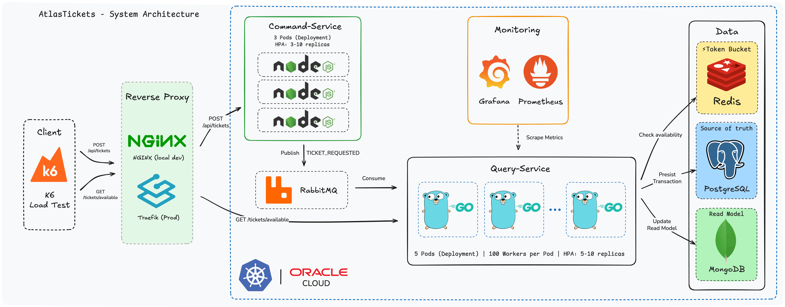
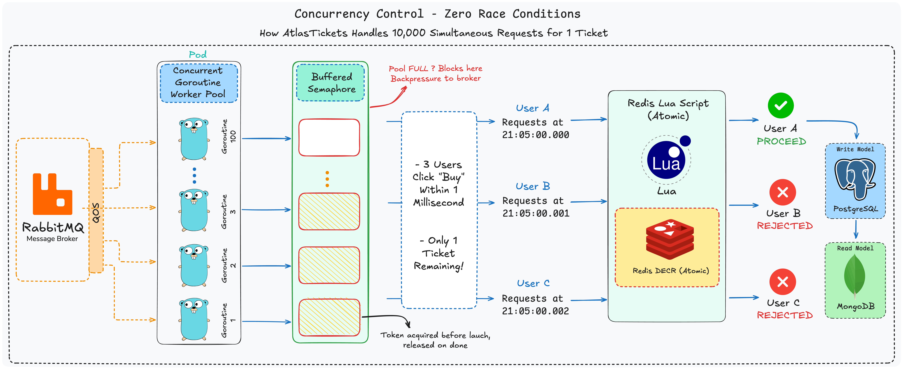
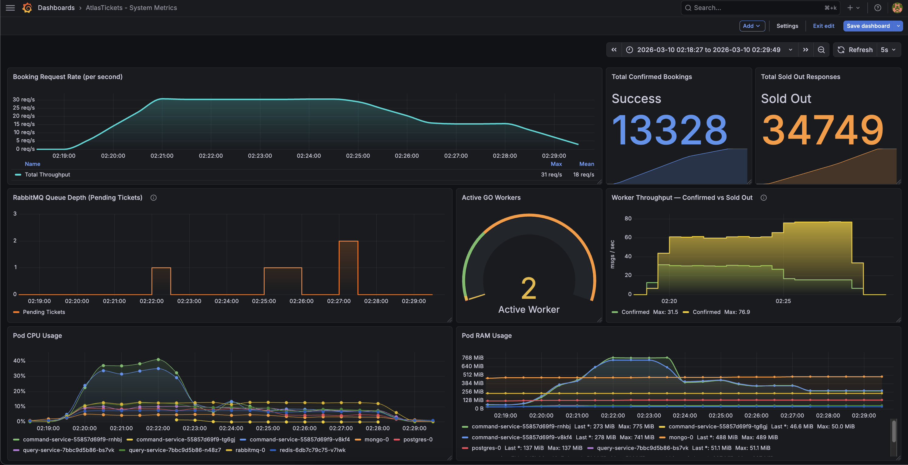

# AtlasTickets

**A production-grade distributed ticketing system engineered to handle extreme concurrency without race conditions or overselling.**

AtlasTickets simulates the real-world problem of a major event ticket sale — thousands of users simultaneously competing for a limited inventory (e.g., an AFCON final or a Taylor Swift concert). The core engineering challenge: guarantee that exactly the number of available seats are sold, no more, at any scale.


---

## Architecture Overview

AtlasTickets is built on a strict **CQRS (Command Query Responsibility Segregation)** pattern backed by an event-driven **RabbitMQ** message bus. The write path and read path are fully decoupled and independently scalable.



### The Primary Innovation: Zero Database Contention

The "double-booking" problem is classically solved with database row locks (pessimistic locking) or version columns (optimistic locking). Both approaches struggle to scale under burst traffic because they amplify database contention.

This system achieves **Zero Race Conditions** by deploying a multi-layer defense strategy centered around **Atomic Redis Lua scripts**.



By handling inventory decrements entirely in memory via Lua (Layer 1), buffering valid requests in RabbitMQ (Layer 2), and controlling writes via a bounded Go worker pool (Layer 3), the system achieves massive throughput and guarantees flawless data consistency.

---

## Technical Stack

| Component | Technology | Version |
|---|---|---|
| Command Service | Node.js (Express) | 20.x |
| Query Service | Go (Gin, prometheus/client_golang) | 1.22+ |
| Message Broker | RabbitMQ | 3.x |
| Primary Database | PostgreSQL | 15 |
| Read Model | MongoDB | 7.x |
| Cache / Inventory | Redis | 7.x |
| Container Orchestration | Kubernetes (K3s) | v1.34.4 |
| Local Dev Cluster | Kind (Kubernetes in Docker) | Latest |
| Ingress (Cloud) | Traefik | Built-in K3s |
| Ingress (Local) | NGINX Ingress Controller | Latest |
| Monitoring | Prometheus + Grafana | kube-prometheus-stack |
| CI/CD | GitHub Actions | — |
| Load Testing | k6 | Latest |
| Cloud Provider | Oracle Cloud Free Tier | ARM64 (VM.Standard.A1.Flex) |


---

## Key Design Decisions

- **Why CQRS for Ticketing?** Reads are extremely frequent (checking availability) while writes are bursty and critical (booking). By splitting the system, we can serve reads instantly from MongoDB/Redis without burdening the PostgreSQL database handling the bookings.
- **Why Redis over DB Locks?** Database locks serialize traffic, bringing systems to a halt under load. Redis processes the atomic decrement in RAM. During our peak load test, Redis instantly rejected 34,749 excess requests, saving the primary database from 34,749 unnecessary transactions.
- **Why RabbitMQ instead of HTTP calls?** Synchronous HTTP calls between the command API and the processing backend create backpressure. RabbitMQ absorbs sudden traffic spikes, allowing the Go worker pool to process valid bookings at a controlled rate.

---

## Performance Under Peak Load

The system's resilience was tested against a simulated rush of **48,077 concurrent requests** (via k6) attempting to buy **13,328 available tickets**.

| Metric | Result |
|---|---|
| Load Test Scenarios | 50,000 VUs Peak |
| Tickets Sold | 13,328 (100% Sell-Through) |
| Requests Rejected (Redis) | 34,749 (Instantly dropped) |
| Oversold Tickets | **0** |
| Race Conditions | **0** |
| Error Rate | 0.00% |

All tests demonstrated perfect data consistency between the PostgreSQL source of truth and the MongoDB read model.


---

## Project Structure & Deep-Dive Documentation

The full documentation for this complex system is divided into focused guides. 

**Core Repository Documents:**

1. [API Reference](API-REFERENCE.md) - Full endpoint documentation and cURL examples
2. [Architecture & Design Decisions](DESIGN_DECISIONS.md) - Deep dive into design patterns
3. [Load Testing & Results](LOAD_TESTING.md) - How to run k6 and analyze peak metrics
4. [CI/CD Pipeline](CICD_PIPELINE.md) - Automated workflow and GitHub Actions secrets
5. [Kubernetes Deployment Manual](KUBERNETES_MANUAL.md) - Kind (local) and K3s (cloud) clusters
6. [Monitoring & Observability](GRAFANA_MANUAL.md) - Prometheus and Grafana dashboards
7. [Troubleshooting](TROUBLESHOOTING.md) - Common issues and database reset commands

---

## Quick Start (Local Development)

The fastest way to test the API locally is using Docker Compose.

```bash
# 1. Clone the repository
git clone https://github.com/khalilaitnouisse/atlas-tickets.git
cd atlas-tickets

# 2. Start all services and databases
docker-compose up -d --build

# 3. Check availability
curl "http://localhost:4000/tickets/available?match_id=3&category=VIP"

# 4. Purchase a ticket
curl -X POST http://localhost:3000/api/tickets \
  -H "Content-Type: application/json" \
  -d '{
    "match_id": 3,
    "category": "VIP",
    "user_id": 1000,
    "quantity": 1
  }'
```

---

## Deployment Highlights

**CI/CD Automation:**
Both services utilize fully automated CI/CD pipelines via GitHub Actions. Pushes to `main` trigger multi-architecture Docker Engine builds (supporting `linux/amd64` and `linux/arm64` for Oracle Cloud). Tagged images are pushed to Docker Hub, and the cloud master node is updated seamlessly via rolling deployments.


**Observability:**
We use `kube-prometheus-stack` to scrape `/metrics`. Custom dashboards track `atlastickets_bookings_confirmed_total`, sold-out events, and active worker pool sizes in real-time.



---

## License

This project is licensed under the MIT License.