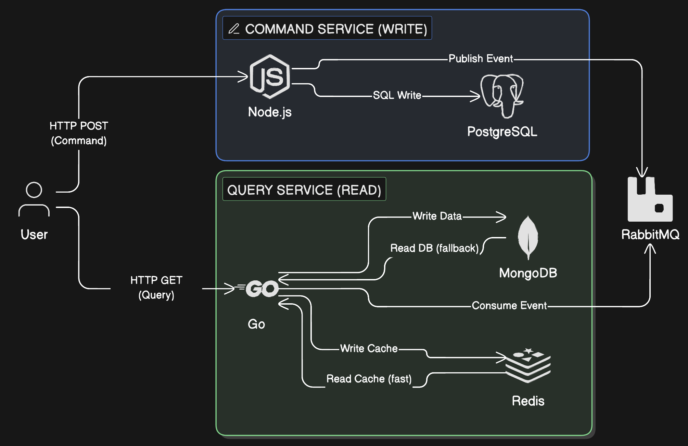

# 🎫 AtlasTickets: High-Concurrency Event Ticketing System


**AtlasTickets** is a distributed microservices system designed to handle high-demand ticket sales (e.g., AFCON , concerts) without overselling or crashing. It implements the **CQRS (Command Query Responsibility Segregation)** pattern and uses an **Event-Driven Architecture** to ensure data consistency across multiple databases.

The core goal of this project was to solve the **"Double Booking" Race Condition** problem using Optimistic Locking and a Semaphore-based Worker Pool in Go.

---

## 🏗️ Architecture

The system follows a strict **CQRS** pattern:



* **Command Side (Write):** A **Node.js** service accepts HTTP requests and publishes events to **RabbitMQ**. It focuses on high throughput ingestion.
* **Query Side (Read/Process):** A **Go (Golang)** service consumes events, processes business logic, and enforces strict ACID transactions using **PostgreSQL**.
* **Polyglot Persistence:**
    * **PostgreSQL:** The Source of Truth (Write Model). Uses **Optimistic Locking** to prevent race conditions.
    * **MongoDB:** The Read Model (Projections) for fast querying.
    * **Redis:** Caching layer for real-time inventory counters.

---

## 🛠 Tech Stack

* **Services:** Node.js (Express), Go (Golang)
* **Message Broker:** RabbitMQ
* **Databases:** PostgreSQL 15, MongoDB, Redis
* **Infrastructure:** Docker, Docker Compose
* **Testing:** Custom Go Load Tester (Simulating concurrent attacks)

---

## ⚡ Key Features

### 1. Concurrency Control (The "Double Booking" Fix)
Solved the classic race condition where 2 users buy the last seat simultaneously.
* **Solution:** Implemented **Optimistic Locking** using a `version` column in Postgres.
* **Logic:** `UPDATE inventory SET sold = sold + 1, version = version + 1 WHERE id = $1 AND version = $2`
* **Result:** If 100 users try to buy the last 1 seat, exactly 1 succeeds and 99 fail gracefully.

### 2. High-Performance Worker Pool
To utilize Go's concurrency without crashing the database, I implemented a **Semaphore-based Worker Pool**.
* **Pattern:** Bounded Parallelism.
* **Throughput:** Processes **10 concurrent ticket requests** in parallel.
* **Safety:** Uses `sync.WaitGroup` for graceful shutdowns to prevent data corruption during restarts.

### 3. Event-Driven Reliability
* **QoS (Quality of Service):** RabbitMQ prefetch limits ensure the Go service is never overwhelmed by traffic spikes.
* **Manual Acks:** Messages are only removed from the queue *after* the database transaction successfully commits.

---

## 🧪 Performance & Load Testing

I wrote a custom **Stress Test Script in Go** to validate the architecture.

**Scenario:**
* **Supply:** 50 VIP Seats.
* **Demand:** 200 Concurrent Users firing requests instantly.

**Results:**
| Metric | Outcome |
| :--- | :--- |
| **Requests Sent** | 200 |
| **Tickets Sold** | **50** (Exactly) |
| **Oversold** | **0** (Zero race conditions) |
| **Rejected** | 150 (Correctly marked as SOLD_OUT) |
| **Processing Time** | ~4.3s for 200 transactions |

---

## 🏃‍♂️ How to Run

### Prerequisites
* **Docker & Docker Compose** (Required)
* **Go 1.22+** (Optional, to run load tests locally)
* **Node.js 18+** (Optional, for local development)

### 1. Start the Infrastructure
```bash
# Clone the repo
git clone https://github.com/yourusername/atlastickets.git
cd atlastickets

# Start all services (Postgres, Mongo, RabbitMQ, Node, Go)
docker-compose up -d --build
```

### 2. Initialize the Database
The **Command Service** (Node.js) automatically initializes the database schema and seed data on startup. 
Use `docker ps` to verify all containers are healthy.

### 3. Run the Stress Test (Simulate a Flash Sale)

This script simulates 200 users trying to buy tickets simultaneously.

```bash
# 1. Reset the database (optional, deletes old data)
# Note: Seed data is managed by command-service/db.js, but you can manually reset if needed.

# 2. Run the attack from the root directory
go run query-service/test/stress.go
```

### 4. Verify Results

Check the database to prove no tickets were oversold.

```bash
docker exec -it atlas-postgres psql -U atlas -d atlastickets -c "SELECT sold_seats FROM ticket_inventory WHERE match_id=1;"
```

---

## 📂 Project Structure

```
.
├── command-service/      # Node.js API (Producer)
│   ├── controllers/      # Ticket purchase logic
│   ├── routes/           # API Routes
│   ├── services/         # RabbitMQ Producer
│   ├── db.js             # DB Connection & Retry Logic
│   └── app.js            # Entry Point & Auto-DB Init
├── query-service/        # Go Worker (Consumer)
│   ├── events/           # RabbitMQ Consumer with Worker Pool
│   ├── database/         # Postgres & Mongo Connections
│   ├── services/         # Business Logic & Optimistic Locking
│   ├── models/           # Go Structs
│   └── test/             # Stress Testing Scripts (stress.go)
├── docker/               # Infrastructure Config
│   └── postgres/         # SQL Scripts (Schema, Seeds, Indexes)
└── docker-compose.yml    # Container Orchestration
```

## 🔮 Future Improvements
- [ ] Deploy to Kubernetes (K8s) with Helm Charts.
- [ ] Add Prometheus & Grafana for real-time monitoring of the worker pool.
- [ ] Implement Dead Letter Queues (DLQ) for failed transactions.